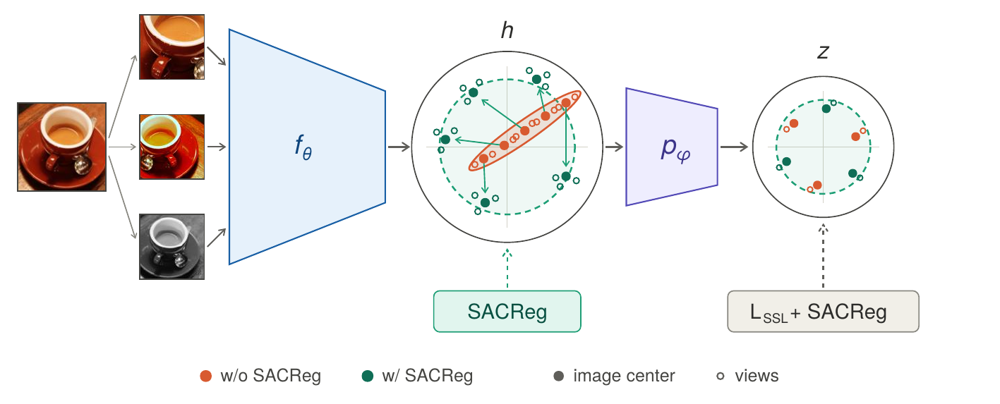

# λ-JEPA

Code for *λ-JEPA: Spectral Anti-Collapse Regularization for Self-Supervised Learning*. It contains the training
code for λ-JEPA and for the baselines of the paper (SimCLR, BYOL, VICReg, DINO, LeJEPA, VISReg), each with the
option of adding SACReg at the backbone, the evaluation protocols, the video trainer, and the two-layer experiments
of the theory appendix.

<p align="center">
  
</p>

The regularizer is `SACReg` in `sslgap/methods/_common.py`; λ-JEPA is `sslgap/methods/lambdajepa.py`. Adding
SACReg to another method's backbone is `+method.h_reg=sacreg +method.h_lamb=<weight>`. In the code the paper's
β_z and β_h are `w_floor` and `h_lamb`, and the logged terms are `moment_kl` and `h_moment_kl`.

## Setup

```bash
uv sync
source .venv/bin/activate
bash scripts/selftest.sh      # one GPU, a few minutes
```

The video trainer under `video/levjepa/` has its own environment (`uv sync` there).

Datasets are expected at `~/data/imagenet`, `~/data/imagenet100` (the CMC split; class list in `data/`) and
`~/data/ssltransfer` (downloaded on first use). For video, `LEVJEPA_DATA_ROOT`, `SSV2_CLIPFILES` and
`K400_CLIPFILES` point at the clip stores built by the scripts in `video/levjepa/scripts/`.

Every step below is a plain command; we ran them as cluster jobs. Multi-GPU steps expect the usual `torchrun` or
`srun` environment.

## ImageNet-1k

```bash
bash scripts/in1k.sh vits|vitb 100|400
```

Trains λ-JEPA with the paper's settings on two GPUs and resumes from the last checkpoint if interrupted.
Evaluate a checkpoint with `python experiments/bench_probe.py <ckpt> <run>` (linear probe and kNN) and
`python experiments/transfer_visreg.py native:<ckpt> <tag>` (transfer).

## ImageNet-100

```bash
bash scripts/in100_cells.sh list                  # the fourteen cells
bash scripts/in100_cells.sh train <cell> [seed]   # one cell, one GPU
bash scripts/in100_cells.sh land <run_id>         # probes and representation statistics
```

The cells are each baseline with and without SACReg, and λ-JEPA with and without its backbone term; the paper
averages seeds 0, 1 and 2. `experiments/twospace.py` computes the class-separability and view-sensitivity
statistics, and `experiments/feature_drift.py` the feature and kernel drift.

## Video

From `video/levjepa/`:

```bash
bash scripts/train_k710_vits.sh                                  # ViT-S/16, eight GPUs
MAX_EPOCHS=515 bash scripts/train_k710_vitb.sh                   # ViT-B/16; MAX_EPOCHS=1085 resumes the same run
bash scripts/attentive_probe_in1k.sh <ckpt> <out csv>
bash scripts/video_probe.sh ssv2|k400 attentive|linear_mean <ckpt> <out csv>
bash scripts/k400_feature_cache.sh <cache dir> name=<ckpt>       # then python experiments/k400_features_read.py --cache <cache dir>
```

## Theory

`theory/two_layer_linear/test_reg_encoder.py` and the drivers in `theory/two_layer_relu/` run on a CPU and need
no data.

## Third-party code

Nothing is vendored. The baselines follow the public implementations: [solo-learn](https://github.com/vturrisi/solo-learn)
for SimCLR, BYOL and VICReg, the official [DINO](https://github.com/facebookresearch/dino) code, the authors'
LeJEPA code and its [Lightly](https://github.com/lightly-ai/lightly) benchmark, and the
[VISReg](https://github.com/HaiyuWu/VISReg) code for the method and its transfer protocol. `video/levjepa/` is our
modified copy of a few files of the [LeVJEPA](https://github.com/MLO-lab/LeVJEPA) trainer (MIT, see its `LICENSE`;
commit `3ea0dda`) with our loss and loaders added; for the rest of the trainer see the upstream repository.

Checkpoints and result files are not included.

## Citation

```bibtex
@misc{demirel2026lambdajepa,
      title={$\lambda$-JEPA: Spectral Anti-Collapse Regularization for Self-Supervised Learning},
      author={Berker Demirel and Clémentine Dominé and Valentino Maiorca and Marco Fumero and Marco Mondelli and Francesco Locatello},
      year={2026},
      eprint={2609.35288},
      archivePrefix={arXiv},
      primaryClass={cs.LG},
      url={https://arxiv.org/abs/2609.35288},
}
```
